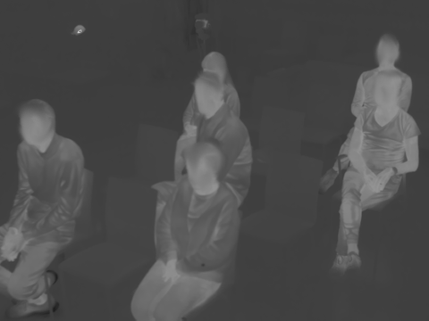
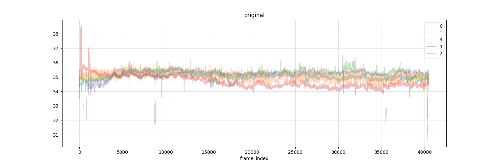
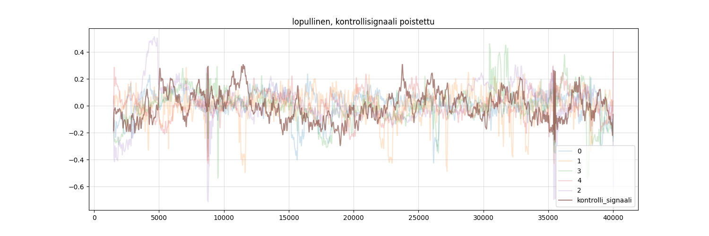

# Data and software services - case thermal camera analysis

## Face temperature measurements from crowd thermal camera image

- Shared experience in the audience
- Temperature measurement using thermal camera footage
- Extracting temperature measurements.
  - Converting the data files to temperatures
  - Can we track individual faces in the video?

***

## Data and computing is everywhere

- [Data Agents](https://www.aalto.fi/en/services/data-agents)
- [Aalto Scientific Computing](https://scicomp.aalto.fi/)
- [Aalto Research Software Engineers](https://scicomp.aalto.fi/rse/)

***

## Research Software Engineers

- The best way to contact us is our [daily Zoom garage](https://scicomp.aalto.fi/help/garage/)

<table style="width:100%">
  <tr>
    <th style="width:50%">Skills</th>
    <th style="width:50%">Broadly, we</th>
  </tr>
  <tr>
    <td style="width:50%">
      <ul>
        <li><b>Programming and software</b></li>
        <li><b>Data</b>, data systems, databases, data pipelines</li>
        <li><b>Scale-up</b>, high-performance computing</li>
        <li><b>Automation</b> and <b>reproducibility</b></li>
        <li><b>Open-source</b> software: packaging, distribution</li>
        <li><b>Data analysis</b>: preprocessing, software support
          <ul><li>Anonymization as a service</li></ul>
        </li>
      </ul>
      … and literally whatever else you may need about software, data, and computing.
    </td>
    <td style="width:50%">
      <ul>
        <li><b>Do it for you</b><. You need some custom technical software/platform.  We do it for you, you get straight to your work.</li>
        <li><b>Do it with you</b><. We co-work with your group, teaching as much as we can.</li>
        <li><b>Make it reusable</b><. Something has already done something, but it doesn't work for others. This is a waste (and prevents citations).</li>
      </ul>
      On average, researchers >5 times speedup (time we spend vs time they save)
    </td>
  </tr>
</table>

***

## Data Agents: domain-aware data support

- **Help** researchers with data handling related questions, including handling personal data
- **Advice and review** of data management plans
- **Support** data-based research
- **Promote and communicate** open science and best practices, such as FAIR data
- **Connect** research groups with existing RDM tools, services and infrastructures
- **Teach** beginner and advanced RDM and Open Science lectures and tutorials [See future training](https://www.aalto.fi/en/services/research-data-management-rdm-and-open-science#1-learn-about-research-data-management)

***

## Reading the file
- Extracting a grid of temperature values from the seq file data.
- https://github.com/rantahar/seq_file

***

## Face tracking

- Simple face location algorithms:
  - Fitting an oval
  - watershead
- Using a mean temperature image as a guide
- Manual labeling and training a machine learning algorithm
- https://github.com/rantahar/thermal_faces

***

## Individual temperatures

- Noice, outliers and spurious correlations
  - Inconsistent face detection
  - Moving subjects
  - Room and camera temperature changes
- Control signal from an empty seat

***

## The rest is research

**Contacting RSEs:**
 - scicomp.aalto.fi/rse
 - scicomp.aalto.fi/help/garage
 - rse-group@aalto.fi

**Contacting data agents:**
  - Often found locally
  - aalto.fi/en/services/data-agents
  - researchdata@aalto.fi

